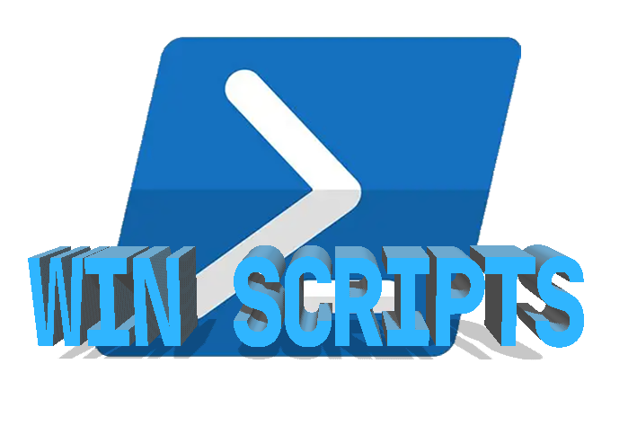

<!-- Improved compatibility of back to top link: See: https://github.com/othneildrew/Best-README-Template/pull/73 -->
<a id="readme-top"></a>
<!--
*** Thanks for checking out the Best-README-Template. If you have a suggestion
*** that would make this better, please fork the repo and create a pull request
*** or simply open an issue with the tag "enhancement".
*** Don't forget to give the project a star!
*** Thanks again! Now go create something AMAZING! :D
-->


<!-- PROJECT LOGO -->
<br />
<div align="center">
  <a href="https://github.com/FishgameStudio/win-scripts">
    
  </a>

# win scripts
<!-- PROJECT SHIELDS -->
<!--
*** I'm using markdown "reference style" links for readability.
*** Reference links are enclosed in brackets [ ] instead of parentheses ( ).
*** See the bottom of this document for the declaration of the reference variables
*** for contributors-url, forks-url, etc. This is an optional, concise syntax you may use.
*** https://www.markdownguide.org/basic-syntax/#reference-style-links
-->


[](https://github.com/FishgameStudio/win-scripts/commits/main)
[](https://pypi.com/project/term2gif)


[](LICENSE)

  <p align="center">
    Some useful PowerShell scripts for Windows!
    <br />
    <a href="https://github.com/FishgameStudio/win-scripts/tree/main/docs"><strong>Explore the docs »</strong></a>
    <br />
    <br />
    <a href="https://github.com/FishgameStudio/win-scripts/tree/main/examples">View Demo</a>
    &middot;
    <a href="https://github.com/FishgameStudio/win-scripts/issues/new?labels=bug">Report Bug</a>
    &middot;
    <a href="https://github.com/FishgameStudio/win-scripts/issues/new?labels=enhancement">Request Feature</a>
  </p>
</div>


<!-- TABLE OF CONTENTS -->
<details>
  <summary>📖 Table of Contents</summary>
  <ol>
    <li>
      <a href="#about-the-project">🔹 About The Project</a>
      <ul>
        <li><a href="#built-with">🔹 Built With</a></li>
      </ul>
    </li>
    <li>
      <a href="#getting-started">🔹 Getting Started</a>
      <ul>
        <li><a href="#prerequisites">🔹 Prerequisites</a></li>
        <li><a href="#installation">🔹 Installation</a></li>
      </ul>
    </li>
    <li><a href="#usage">🔹 Usage</a></li>
    <li><a href="#roadmap">🔹 Roadmap</a></li>
    <li><a href="#contributing">🔹 Contributing</a></li>
    <li><a href="#license">🔹 License</a></li>
    <li><a href="#contact">🔹 Contact</a></li>
    <li><a href="#acknowledgments">🔹 Acknowledgments</a></li>
  </ol>
</details>


<!-- ABOUT THE PROJECT -->
## 🎬 About The Project


> ***"Many developers choose Windows for its broad compatibility and thriving community. However, I've noticed Windows lacks plenty of practical command-line tools. If there were a script to fill this gap, Windows would be perfect."***

**Win Scripts** is a curated collection of abundant practical command-line tools. You may utilize these scripts throughout your daily development workflow to streamline repetitive operations and significantly boost your overall work efficiency.


<p align="right"><a href="#readme-top">🔝back to top</a></p>


### 🛠️ Built With

[](https://learn.microsoft.com/en-us/powershell)

<p align="right"><a href="#readme-top">🔝back to top</a></p>


<!-- GETTING STARTED -->
## 🚀 Getting Started

This is an example of how you may give instructions on setting up your project locally.
To get a local copy up and running follow these simple example steps.

### ✅ Prerequisites

This is an example of how to list things you need to use the software and how to install them.

* PowerShell 7+

### 📦 Installation

Clone the repo:
```sh
git clone https://github.com/FishgameStudio/win-scripts.git
```

<p align="right"><a href="#readme-top">🔝back to top</a></p>


<!-- USAGE EXAMPLES -->
## 💡 Usage

```powershell
# Enable access to execute scripts
Set-ExecutionPolicy RemoteSigned -Scope CurrentUser
# Run
. src/main.ps1
```

_For more examples, please refer to the [Documentation](docs) or [Examples](examples)_

<p align="right"><a href="#readme-top">🔝back to top</a></p>


<!-- ROADMAP -->
## 🗺️ Roadmap
- [ ] Features

See the [open issues](https://github.com/FishgameStudio/win-scripts/issues) for a full list of proposed features (and known issues).

<p align="right"><a href="#readme-top">🔝back to top</a></p>


<!-- CONTRIBUTING -->
## 🤝 Contributing

Contributions are what make the open source community such an amazing place to learn, inspire, and create. Any contributions you make are **greatly appreciated**.

If you have a suggestion that would make this better, please fork the repo and create a pull request. You can also simply open an issue with the tag "enhancement".
Don't forget to give the project a star! Thanks again!

1. Fork the Project
2. Create your Feature Branch (`git checkout -b feature/AmazingFeature`)
3. Commit your Changes (`git commit -m 'Add some AmazingFeature'`)
4. Push to the Branch (`git push origin feature/AmazingFeature`)
5. Open a Pull Request

<p align="right"><a href="#readme-top">🔝back to top</a></p>

### 🌟 Top contributors:

<a href="https://github.com/FishgameStudio/win-scripts/graphs/contributors">
  
</a>


<!-- LICENSE -->
## 📃 License

Distributed under the MIT License. See `LICENSE` for more information.

<p align="right"><a href="#readme-top">🔝back to top</a></p>


<!-- CONTACT -->
## 📬 Contact

Nicola Grey - [popxh@outlook.com](mailto:popxh@outlook.com)

Project Link: [https://github.com/FishgameStudio/win-scripts](https://github.com/FishgameStudio/win-scripts)

<p align="right"><a href="#readme-top">🔝back to top</a></p>


<!-- ACKNOWLEDGMENTS -->
## 🙏 Acknowledgments

* [Best-README-Template](https://github.com/othneildrew/Best-README-Template)
* [PowerShell](https://github.com/PowerShell/PowerShell)

<p align="right"><a href="#readme-top">🔝back to top</a></p>